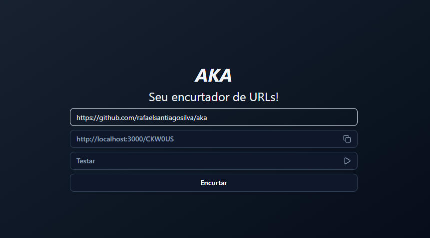

# AKA 📎

Um simples encurtador de URL.

## Stack 🛠️

## Funcionamento ⚙️

Basta digitar uma URL no input e clicar no botão para encurtar. Assim, uma nova URL será gerada onde você poderá testar e copiar através de botões do próprio site.

## Motivação 🏆

O projeto foi criado para solidificar conceitos de:

- API serverless do Next.js
- Shadcn UI como biblioteca de componentes
- Cache com Redis
- Cron Jobs

